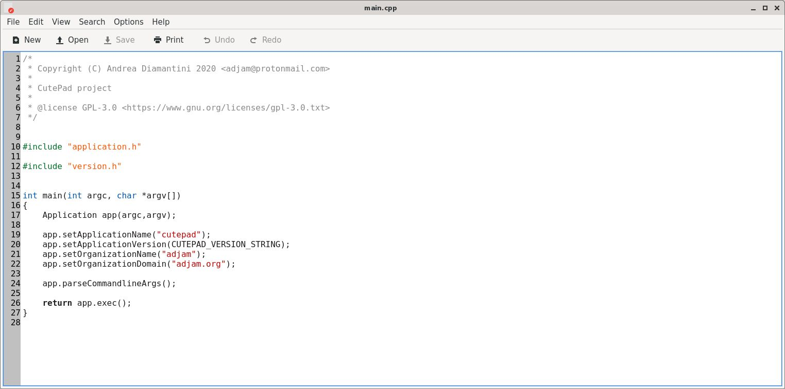
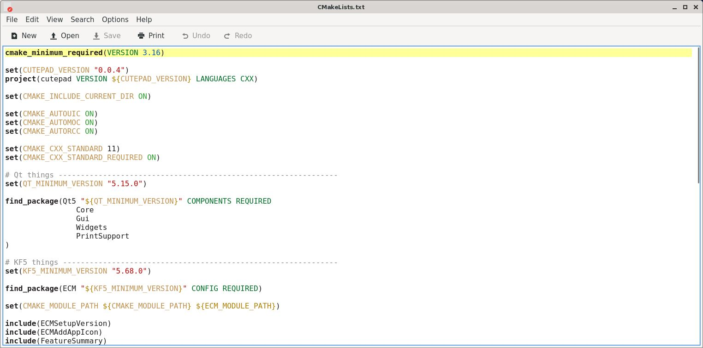
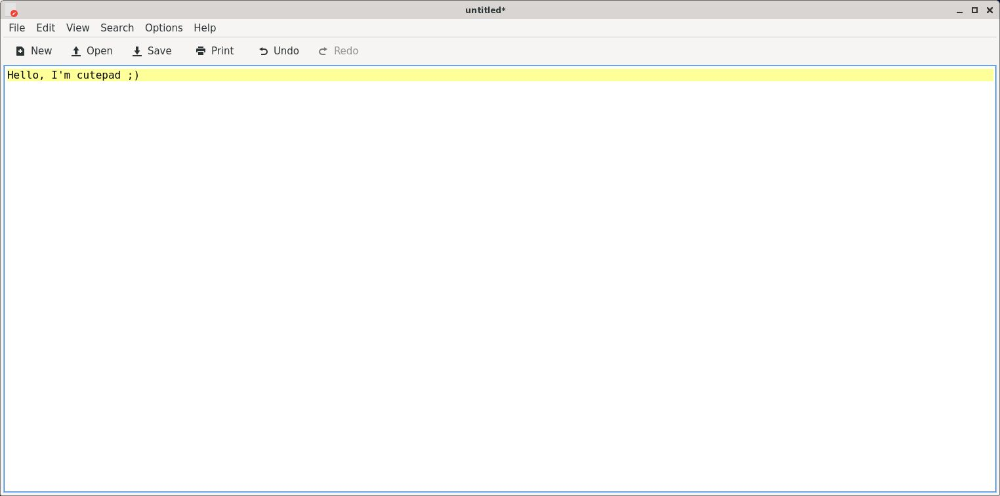

# Cutepad

Cutepad is a lightweight Qt plain-text editor, created to emulate 
the beautiful KWrite editor, but with minimal deps.

The idea is also to fast move the project to Qt6, as soon as 
it has its main features in place.

Another target of it will be release packages for Windows, Mac, Linux.

Its main features include:

    * syntax highlighting
    * line numbers
    * current line highlight
    * text zoom
    * find && replace widgets
    * printing
    * ... and so on ...

Here are some screenshots (because seeing is believing...)

    

